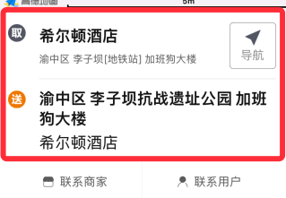

显示基础的取件、收件信息, 并显示导航信息



```jsx
import AddressInfo from '@/components/AddressInfo';

const quInfo = {
  title: '商家名字',
  subtitle: '详细地址详细地址详细地址详细地址详细地址详细地址'
};

const songInfo = {
  title: '详细地址详细地址详细地址详细地址详细地址',
  name: '收件人姓名'
};

ReactDOM.render(
   <AddressInfo quInfo={quInfo} songInfo={songInfo} isShowNaviQu={true} NaviOnPress={navLocation} />,
  mountNode
);
```