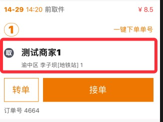

只显示取件信息



```jsx
import AddressInfo from '@/components/AddressInfo';

const quInfo = {
  title: '商家名字',
  subtitle: '详细地址详细地址详细地址详细地址详细地址详细地址'
};

ReactDOM.render(
   <AddressInfo quInfo={quInfo} />,
  mountNode
);
```