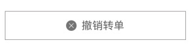

显示基础的取件、收件信息




```jsx
import Button from '@/components/Button';

ReactDOM.render(
  <Fragment>
    <Button title='撤销' type='default' icon={image}  style={styles.btn} />
    <Button title='接单' type='primary' style={styles.btn} />
    <Button title='转单' type='plain' style={styles.btn} />
  </Fragment>,
  mountNode
);
```