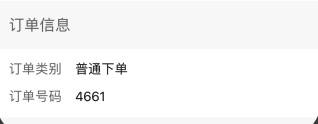

描述列表组件



```jsx
import DescriptionList from '@/components/DescriptionList';
const { Description } = DescriptionList;

ReactDOM.render(
  <DescriptionList title='订单信息'>
    <Description label='订单类别' value="1111" />
    <Description label='一键下单单号' value="111" />
  </DescriptionList>,
  mountNode
);
```