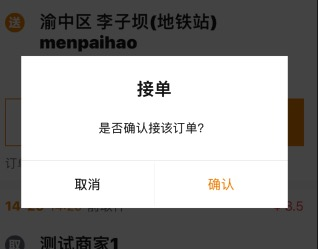

封装的modal



```jsx
import Modal from '@/components/Modal';

ReactDOM.render(
  <Modal
    leftText='取消'
    rightText='确认'
    highLightPosition='right'
    title='接单'
    isVisible={isShowReceiveModal}
    onRight={this.receiveOrderOk}
    onLeft={this.receiveOrderCancel}
    >
      <Text style={styles.modal}>是否确认接该订单？</Text>
    </Modal>,
  mountNode
);
```